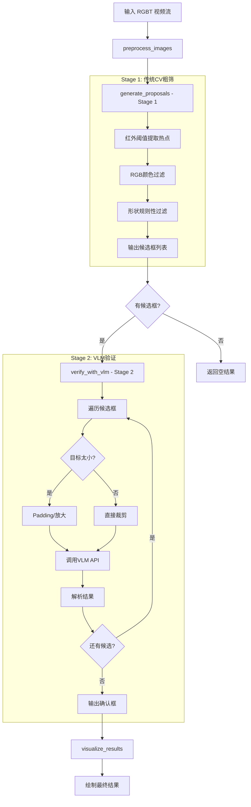

# Oil Spill Detector 使用指南

## 概述

Oil Spill Detector 是一个用于冬季高空无人机视角下石油泄漏监测的两阶段检测系统：

- **Stage 1**: 传统 CV 快速粗筛（OpenCV 阈值 + 轮廓分析）
- **Stage 2**: VLM 语义验证（Qwen2.5-VL-72B-Instruct）

## 安装依赖

```bash
pip install opencv-python numpy openai
```

## 快速开始

### 1. 基本使用

```python
import cv2
from src.oil_spill_detector import OilSpillDetector

# 初始化检测器
detector = OilSpillDetector(
    ir_threshold=200,           # IR 热点阈值
    rgb_dark_threshold=80,       # RGB 深色阈值
    min_area=500,              # 最小轮廓面积
    vlm_api_key="your-api-key", # VLM API 密钥（或设置环境变量 DASHSCOPE_API_KEY）
    vlm_model="qwen2.5-vl-72b-instruct"  # Qwen2.5-VL-72B-Instruct 模型
)

# 加载图像
ir_frame = cv2.imread("path/to/ir_image.jpg", cv2.IMREAD_GRAYSCALE)
rgb_frame = cv2.imread("path/to/rgb_image.jpg")

# 运行检测
proposals, verified_results = detector.detect(ir_frame, rgb_frame)

# 可视化结果
detector.visualize_results(
    rgb_frame,
    proposals,
    verified_results,
    show=True,
    save_path="results/detection_result.jpg"
)
```

### 2. 运行示例

```bash
python examples/run_detector.py
```

### 3. 运行测试

```bash
python tests/test_oil_spill_detector.py
```

## 配置参数

| 参数 | 类型 | 默认值 | 说明 |
|------|------|----------|------|
| `ir_threshold` | int | 200 | IR 热点检测阈值 (0-255) |
| `rgb_dark_threshold` | int | 80 | RGB 深色过滤阈值 (0-255) |
| `min_area` | int | 500 | 最小轮廓面积 |
| `max_area` | int | 100000 | 最大轮廓面积 |
| `vlm_api_key` | str | None | VLM 服务 API 密钥 |
| `vlm_model` | str | "qwen2.5-vl-72b-instruct" | VLM 模型名称 |
| `clahe_clip_limit` | float | 3.0 | CLAHE 对比度限制 |
| `clahe_grid_size` | tuple | (8, 8) | CLAHE 网格大小 |
| `gaussian_blur_kernel` | int | 5 | 高斯模糊核大小 |
| `morph_kernel_size` | int | 20 | 形态学操作核大小 |
| `min_crop_size` | int | 64 | VLM 输入的最小裁剪大小 |
| `padding_size` | int | 10 | 裁剪区域周围的填充大小 |

## 工作流程



## VLM System Prompt 设计

System Prompt 是区分土壤、机械和油污的关键：

| 特征 | 石油泄漏 | 裸露土壤 | 管道/设备 | 车辆/机械 | 阴影 |
|------|----------|----------|-----------|-----------|------|
| RGB颜色 | 黑色/深褐色 | 棕褐色 | 各种颜色 | 各种颜色 | 黑色/深灰 |
| 红外特征 | 放射状梯度 | 温度均匀 | 高温规则 | 高温规则 | 低温均匀 |
| 边缘特征 | 锯齿/羽化 | 锐利 | 锐利 | 锐利 | 锐利 |
| 形状 | 不规则 | 规则 | 几何规则 | 几何规则 | 几何规则 |
| 扩散感 | 液体渗透 | 无 | 无 | 无 | 无 |

## VLM API 配置

系统已配置使用 **Qwen2.5-VL-72B-Instruct** 模型，通过阿里云 DashScope API 调用。

### 配置方式

**方式 1: 直接设置 API 密钥**

```python
detector = OilSpillDetector(
    vlm_api_key="sk-ef7db77064064747936dd65767cbd794",
    vlm_model="qwen2.5-vl-72b-instruct"
)
```

**方式 2: 使用环境变量**

```bash
export DASHSCOPE_API_KEY="sk-ef7db77064064747936dd65767cbd794"
```

```python
import os
detector = OilSpillDetector(
    vlm_api_key=os.getenv("DASHSCOPE_API_KEY"),
    vlm_model="qwen2.5-vl-72b-instruct"
)
```

### API 调用实现

VLM API 调用已在 [`src/oil_spill_detector.py`](../src/oil_spill_detector.py) 的 `verify_with_vlm` 方法中实现：

```python
from openai import OpenAI
import os

client = OpenAI(
    api_key=self.vlm_api_key or os.getenv("DASHSCOPE_API_KEY"),
    base_url="https://dashscope.aliyuncs.com/compatible-mode/v1",
)

response = client.chat.completions.create(
    model=self.vlm_model,
    messages=[
        {
            "role": "user",
            "content": [
                {"type": "image_url", "image_url": {"url": base64_img}},
                {"type": "text", "text": system_prompt},
            ],
        },
    ],
    temperature=0.01,
)

content = response.choices[0].message.content
content = content.replace("```json", "").replace("```", "").strip()
result = json.loads(content)
return VLMResult(
    is_leak=result.get("is_leak", False),
    confidence=result.get("confidence", "low"),
    reason=result.get("reason", "No reason provided")
)
```

## 输出说明

- **红色框**: Stage 1 生成的候选框（被 VLM 拒绝）
- **绿色框**: VLM 确认的石油泄漏区域

## 故障排除

### 问题: 没有检测到任何候选框

**解决方案**:
- 调整 `ir_threshold` 参数（降低阈值以检测更多热点）
- 调整 `rgb_dark_threshold` 参数（降低阈值以检测更多深色区域）
- 调整 `min_area` 参数（降低最小面积）

### 问题: 检测到太多误报

**解决方案**:
- 提高 `ir_threshold` 参数
- 提高 `rgb_dark_threshold` 参数
- 提高 `min_area` 参数
- 调整形状过滤参数（修改 `_filter_regular_shapes` 方法）

### 问题: VLM 验证失败

**解决方案**:
- 检查 API 密钥是否正确（`DASHSCOPE_API_KEY` 环境变量或 `vlm_api_key` 参数）
- 检查网络连接（需要访问阿里云 DashScope API）
- 检查 API 配额是否充足
- 查看错误日志获取详细信息

## 许可证

MIT License
