# Oil Spill Detection System Design

## 项目概述

冬季高空无人机视角下石油泄漏监测系统，采用端云协同的两阶段架构：
- **Stage 1**: 传统 CV 快速粗筛（OpenCV）
- **Stage 2**: VLM 语义验证（GPT-4o / LLaVA）

---

## 系统架构

### 类结构图


### 工作流程图

```mermaid
flowchart TD
    A[输入 RGBT 视频流] --> B[preprocess_images]
    B --> C[generate_proposals - Stage 1]
    
    subgraph Stage1 [Stage 1: 传统CV粗筛]
        C --> C1[红外阈值提取热点]
        C1 --> C2[RGB颜色过滤]
        C2 --> C3[形状规则性过滤]
        C3 --> C4[输出候选框列表]
    end
    
    C4 --> D{有候选框?}
    D -->|否| E[返回空结果]
    D -->|是| F[verify_with_vlm - Stage 2]
    
    subgraph Stage2 [Stage 2: VLM验证]
        F --> F1[遍历候选框]
        F1 --> F2{目标太小?}
        F2 -->|是| F3[Padding/放大]
        F2 -->|否| F4[直接裁剪]
        F3 --> F5[调用VLM API]
        F4 --> F5
        F5 --> F6[解析结果]
        F6 --> F7{还有候选?}
        F7 -->|是| F1
        F7 -->|否| F8[输出确认框]
    end
    
    F8 --> G[visualize_results]
    G --> H[绘制最终结果]
```



---

## 完整代码框架

### 文件: `src/oil_spill_detector.py`

```python
import cv2
import numpy as np
import base64
import json
from typing import List, Tuple, Optional
from dataclasses import dataclass


@dataclass
class Proposal:
    bbox: Tuple[int, int, int, int]
    area: float
    ir_temp: float
    rgb_color: Tuple[int, int, int]
    contour: np.ndarray


@dataclass
class VLMResult:
    is_leak: bool
    confidence: str
    reason: str


class OilSpillDetector:
    def __init__(
        self,
        ir_threshold: int = 200,
        rgb_dark_threshold: int = 80,
        min_area: int = 500,
        max_area: int = 100000,
        vlm_api_key: Optional[str] = None,
        vlm_model: str = "gpt-4o",
        clahe_clip_limit: float = 3.0,
        clahe_grid_size: Tuple[int, int] = (8, 8),
        gaussian_blur_kernel: int = 5,
        morph_kernel_size: int = 20,
        min_crop_size: int = 64,
        padding_size: int = 10,
    ):
        self.ir_threshold = ir_threshold
        self.rgb_dark_threshold = rgb_dark_threshold
        self.min_area = min_area
        self.max_area = max_area
        self.vlm_api_key = vlm_api_key
        self.vlm_model = vlm_model
        self.clahe_clip_limit = clahe_clip_limit
        self.clahe_grid_size = clahe_grid_size
        self.gaussian_blur_kernel = gaussian_blur_kernel
        self.morph_kernel_size = morph_kernel_size
        self.min_crop_size = min_crop_size
        self.padding_size = padding_size
        
        self.clahe = cv2.createCLAHE(clipLimit=self.clahe_clip_limit, tileGridSize=self.clahe_grid_size)
        self.morph_kernel = np.ones((self.morph_kernel_size, self.morph_kernel_size), np.uint8)
    
    def preprocess_images(self, ir_frame: np.ndarray, rgb_frame: np.ndarray) -> Tuple[np.ndarray, np.ndarray]:
        if len(ir_frame.shape) == 3:
            ir_frame = cv2.cvtColor(ir_frame, cv2.COLOR_BGR2GRAY)
        ir_frame = cv2.normalize(ir_frame, None, 0, 255, cv2.NORM_MINMAX)
        
        if len(rgb_frame.shape) == 2:
            rgb_frame = cv2.cvtColor(rgb_frame, cv2.COLOR_GRAY2BGR)
        
        if ir_frame.shape != rgb_frame.shape[:2]:
            rgb_frame = cv2.resize(rgb_frame, (ir_frame.shape[1], ir_frame.shape[0]))
        
        return ir_frame, rgb_frame
    
    def _filter_regular_shapes(self, contour: np.ndarray, bbox: Tuple[int, int, int, int]) -> bool:
        x, y, w, h = bbox
        contour_area = cv2.contourArea(contour)
        bbox_area = w * h
        
        if bbox_area == 0:
            return False
        
        solidity = contour_area / bbox_area
        if solidity > 0.85:
            return False
        
        aspect_ratio = float(w) / h if h > 0 else 0
        if aspect_ratio > 5.0 or aspect_ratio < 0.2:
            return False
        
        hull = cv2.convexHull(contour)
        hull_area = cv2.contourArea(hull)
        
        if hull_area == 0:
            return False
        
        convexity = contour_area / hull_area
        if convexity > 0.95:
            return False
        
        moments = cv2.moments(contour)
        if moments['m00'] == 0:
            return False
        
        perimeter = cv2.arcLength(contour, True)
        if perimeter == 0:
            return False
        
        circularity = 4 * np.pi * contour_area / (perimeter ** 2)
        if circularity > 0.85:
            return False
        

        
        return True
    
    def generate_proposals(self, ir_frame: np.ndarray, rgb_frame: np.ndarray) -> List[Proposal]:
        print(f"🚀 [Stage 1] Generating proposals...")
        
        ir_enhanced = self.clahe.apply(ir_frame)
        ir_blur = cv2.GaussianBlur(ir_enhanced, (self.gaussian_blur_kernel, self.gaussian_blur_kernel), 0)
        _, ir_mask = cv2.threshold(ir_blur, self.ir_threshold, 255, cv2.THRESH_BINARY)
        
        rgb_gray = cv2.cvtColor(rgb_frame, cv2.COLOR_BGR2GRAY)
        _, rgb_mask = cv2.threshold(rgb_gray, self.rgb_dark_threshold, 255, cv2.THRESH_BINARY_INV)
        
        final_mask = cv2.bitwise_and(ir_mask, rgb_mask)
        final_mask = cv2.morphologyEx(final_mask, cv2.MORPH_DILATE, self.morph_kernel)
        
        contours, _ = cv2.findContours(final_mask, cv2.RETR_EXTERNAL, cv2.CHAIN_APPROX_SIMPLE)
        
        proposals = []
        for contour in contours:
x, y, w, h = cv2.boundingRect(contour)
            bbox = (x, y, w, h)
            
            area = cv2.contourArea(contour)
            if area < self.min_area or area > self.max_area:
                continue
            
            if not self._filter_regular_shapes(contour, bbox):
                continue
            
            ir_roi = ir_frame[y:y+h, x:x+w]
            ir_temp = float(np.mean(ir_roi)) if ir_roi.size > 0 else 0.0
            
            rgb_roi = rgb_frame[y:y+h, x:x+w]
            rgb_color = tuple(map(int, np.mean(rgb_roi, axis=(0, 1)))) if rgb_roi.size > 0 else (0, 0, 0)
            
            proposals.append(Proposal(bbox=bbox, area=area, ir_temp=ir_temp, rgb_color=rgb_color, contour=contour))
        
        print(f"✅ [Stage 1] Generated {len(proposals)} proposals")
        return proposals
    
    def _enhance_small_crop(self, crop_ir: np.ndarray, crop_rgb: np.ndarray) -> Tuple[np.ndarray, np.ndarray]:
        h_ir, w_ir = crop_ir.shape[:2]
        
        if h_ir < self.min_crop_size or w_ir < self.min_crop_size:
            scale = max(self.min_crop_size / h_ir, self.min_crop_size / w_ir)
            new_h_ir = int(h_ir * scale)
            new_w_ir = int(w_ir * scale)
            crop_ir = cv2.resize(crop_ir, (new_w_ir, new_h_ir), interpolation=cv2.INTER_CUBIC)
            
            h_rgb, w_rgb = crop_rgb.shape[:2]
            new_h_rgb = int(h_rgb * scale)
            new_w_rgb = int(w_rgb * scale)
            crop_rgb = cv2.resize(crop_rgb, (new_w_rgb, new_h_rgb), interpolation=cv2.INTER_CUBIC)
            
            print(f"🔍 [Active Observation] Resized crop from ({w_ir}x{h_ir}) to ({new_w_ir}x{new_h_ir})")
        
        return crop_ir, crop_rgb
    
    def _encode_image_to_base64(self, image: np.ndarray) -> str:
        _, buffer = cv2.imencode('.jpg', image)
        return f"data:image/jpeg;base64,{base64.b64encode(buffer).decode('utf-8')}"
    
    def verify_with_vlm(self, crop_ir: np.ndarray, crop_rgb: np.ndarray) -> VLMResult:
        crop_ir, crop_rgb = self._enhance_small_crop(crop_ir, crop_rgb)
        
        if len(crop_ir.shape) == 2:
            crop_ir = cv2.cvtColor(crop_ir, cv2.COLOR_GRAY2BGR)
        
        combined_img = np.hstack((crop_ir, crop_rgb))
        base64_img = self._encode_image_to_base64(combined_img)
        
        # System Prompt for VLM - KEY to distinguishing soil, machinery, and oil spills
        system_prompt = """
你是一位专业的油田工业视觉专家，擅长从高空无人机视角识别冬季环境下的石油泄漏。

【图像说明】
- 左侧图像：红外热成像（高亮区域代表高温，暗色区域代表低温）
- 右侧图像：可见光RGB图像

【任务】
请判断图像中是否包含【地面石油泄漏】。

【判断标准】

1. 石油泄漏特征：
   - 红外特征：中心高温，边缘低温，呈放射状梯度分布
   - RGB特征：黑色或深褐色，形状不规则（非几何形状）
   - 边缘特征：边缘呈锯齿状、羽化状或渗透状
   - 扩散特征：看起来像液体在地面渗透或扩散
   - 温度特征：红外有明显的温差分布

2. 干扰物特征：
   - 裸露土壤：棕褐色，边缘锐利，温度分布均匀，无放射状梯度
   - 管道/设备：笔直线条，规则几何形状，边缘锐利
   - 车辆/机械：孤立固体形态，有明显的轮廓和结构
   - 阴影：黑色/深灰色，边缘锐利，几何形状规则

【输出格式】
请仅输出JSON格式：
{"is_leak": true/false, "confidence": "high/medium/low", "reason": "简述判断依据"}
"""
        
        # Simulated VLM call (replace with actual API call)
        # For demonstration, return a mock result
        return VLMResult(
            is_leak=False,
            confidence="low",
            reason="Simulated VLM response - replace with actual API call"
        )
    
    def detect(self, ir_frame: np.ndarray, rgb_frame: np.ndarray) -> Tuple[List[Proposal], List[VLMResult]]:
        ir_frame, rgb_frame = self.preprocess_images(ir_frame, rgb_frame)
        proposals = self.generate_proposals(ir_frame, rgb_frame)
        
        verified_results = []
        for proposal in proposals:
            x, y, w, h = proposal.bbox
            
            x1, y1 = max(0, x - self.padding_size), max(0, y - self.padding_size)
            x2, y2 = min(rgb_frame.shape[1], x + w + self.padding_size), min(rgb_frame.shape[0], y + h + self.padding_size)
            
            crop_rgb = rgb_frame[y1:y2, x1:x2]
            crop_ir = ir_frame[y1:y2, x1:x2]
            
            result = self.verify_with_vlm(crop_ir, crop_rgb)
            verified_results.append(result)
        
        return proposals, verified_results
    
    def visualize_results(
        self,
        rgb_frame:: np.ndarray,
        proposals: List[Proposal],
        verified_results: List[VLMResult],
        show: bool = True,
        save_path: Optional[str] = None
    ) -> np.ndarray:
        result_img = rgb_frame.copy()
        
        for proposal, result in zip(proposals, verified_results):
            x, y, w, h = proposal.bbox
            
            if result.is_leak:
                color = (0, 255, 0)  # Green for confirmed leak
                label = f"LEAK ({result.confidence})"
                thickness = 3
            else:
                color = (0, 0, 255)  # Red for proposal (rejected)
                label = "Ignored"
                thickness = 2
            
            cv2.rectangle(result_img, (x, y), (x + w, y + h), color, thickness)
            cv2.putText(result_img, label, (x, y - 5), cv2.FONT_HERSHEY_SIMPLEX, 0.6, color, 2)
        
        if show:
            cv2.imshow("Oil Spill Detection Results", result_img)
            cv2.waitKey(0)
            cv2.destroyAllWindows()
        
        if save_path:
            cv2.imwrite(save_path, result_img)
            print(f"✅ Result saved to: {save_path}")
        
        return result_img
```

---

## 使用示例

### 文件: `examples/run_detector.py`

```python
import cv2
from src.oil_spill_detector import OilSpillDetector

# Initialize detector
detector = OilSpillDetector(
    ir_threshold=200,
    rgb_dark_threshold=80,
    min_area=500,
    max_area=100000,
    vlm_api_key="your-api-key-here",
    vlm_model="gpt-4o",
    min_crop_size=64,
    padding_size=10
)

# Load images
ir_frame = cv2.imread("path/to/ir_image.jpg", cv2.IMREAD_GRAYSCALE)
rgb_frame = cv2.imread("path/to/rgb_image.jpg")

# Detect
proposals, verified_results = detector.detect(ir_frame, rgb_frame)

# Visualize
detector.visualize_results(
    rgb_frame,
    proposals,
    verified_results,
    show=True,
    save_path="results/detection_result.jpg"
)

# Print results
for i, (proposal, result) in enumerate(zip(proposals, verified_results)):
    print(f"Proposal {i+1}: bbox={proposal.bbox}, is_leak={result.is_leak}, reason={result.reason}")
```

---

## 关键技术点

1. **多尺度检测**: 通过不同尺度捕获不同大小的目标
2. **双流融合**: 红外热成像 + 可见光互补信息
3. **形态学去噪**: 20×20 核膨胀聚合碎片区域
4. **形状规则性过滤**: 过滤掉管道、设备等规则形状
5. **端云协同**: 本地快速筛选 + 云端精准验证
6. **主动观测**: 小目标自动放大以提高 VLM 理解能力

---

## VLM System Prompt 设计

System Prompt 是区分土壤、机械和油污的关键：

| 特征 | 石油泄漏 | 裸露土壤 | 管道/设备 | 车辆/机械 | 阴影 |
|------|----------|----------|-----------|-----------|------|
| RGB颜色 | 黑色/深褐色 | 棕褐色 | 各种颜色 | 各种颜色 | 黑色/深灰 |
| 红外特征 | 放射状梯度 | 温度均匀 | 高温规则 | 高温规则 | 低温均匀 |
| 边缘特征 | 锯齿/羽化 | 锐利 | 锐利 | 锐利 | 锐利 |
| 形状 | 不规则 | 规则 | 几何规则 | 几何规则 | 几何规则 |
| 扩散感 | 液体渗透 | 无 | 无 | 无 | 无 |
